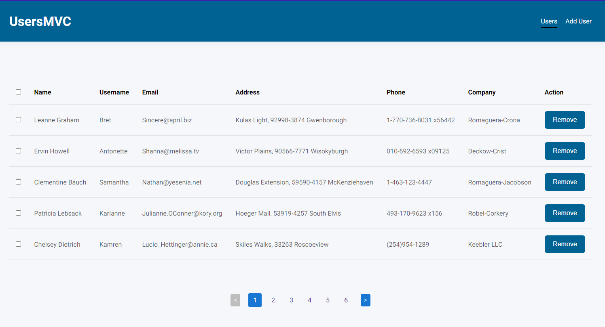
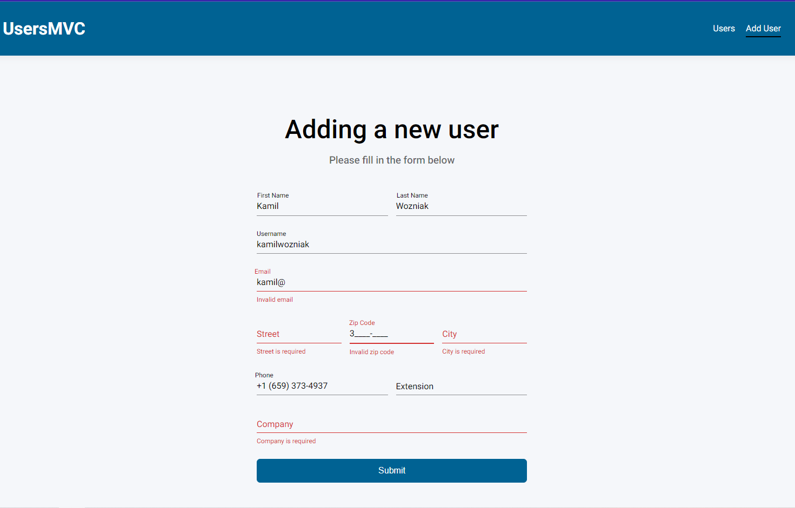

# UsersMVC

[](https://www.php.net/)
[](https://httpd.apache.org/)
[](https://www.docker.com/)
[](https://github.com/sass/node-sass)
[](https://browsersync.io/)

A user-friendly and fully responsive application that displays user data from a JSON file in a tabular format. Built using PHP 8.2 and Apache, this project provides functionalities such as removing users either individually or in bulk, form submission with server and client-side validation, custom input masking, and pagination.

## Table of Contents

- [Features](#features)
- [Screenshots](#screenshots)
- [Installation](#installation)
- [Usage](#usage)

## Features

- Displays user data from a JSON file in a tabular format
- Allows removal of users, either individually or in bulk
- Provides a form for adding new users with custom input masking for phone, zip code, and number extension
- Implements server and client-side validation, including checking for email duplication
- Features pagination with a maximum of 5 rows per page
- Styles mimic Google's material design, with a navigation bar that includes a UsersMVC logo and two hyperlinks with active state functionality

## Screenshots





## Installation

You need to have Docker installed on your machine to set up and run this project.

Clone the repository and install the dependencies:

```bash
git clone https://github.com/WoXuS/users-mvc.git
cd users-mvc
npm install
```

Build and run the Docker container:

```bash
docker-compose up --build -d
```

## Usage

To start the development server, run:

```bash
npm start
```

For hot-reload functionality open http://localhost:3000 to view the proxied application in your browser.
Open http://localhost:8000 for the application straight from Docker.